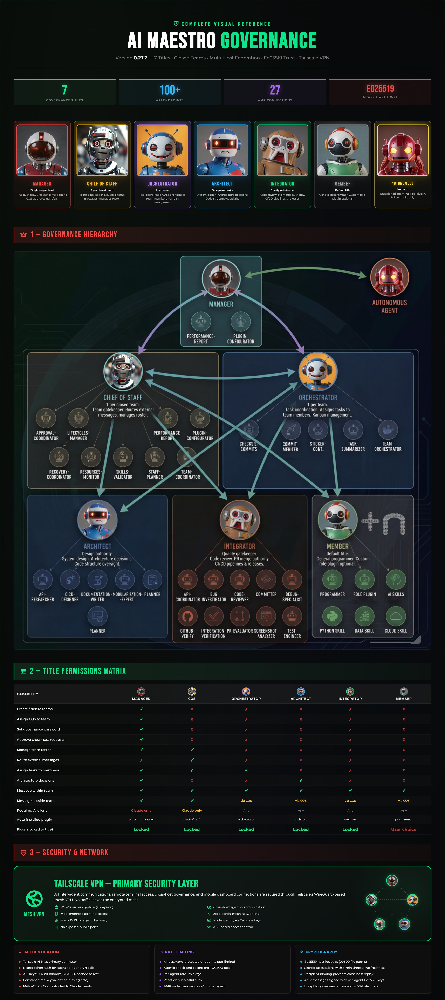

<div align="center">


# AI Maestro

*I was running 35 AI agents across multiple terminals and became the human mailman between them. So I built AI Maestro.*

**Orchestrate your AI coding agents from one dashboard — with persistent memory, agent-to-agent messaging, and multi-machine support.**

[](https://github.com/Emasoft/ai-maestro/releases)
[-lightgrey)](https://github.com/Emasoft/ai-maestro)
[](./LICENSE)
[](https://github.com/Emasoft/ai-maestro)


### Governance & Communication Rules



[Quick Start](#-quick-start) · [Features](#-features) · [Documentation](#-documentation) · [Contributing](./CONTRIBUTING.md)

</div>

---

## The Story

I gave an AI agent a real task — not autocomplete, a real engineering problem. It checked the code, read the logs, queried the database, and came back with the answer. That was the moment. *This thing can actually work.*

Within a week I was running 35 agents across terminals. They were productive, but they couldn't talk to each other. I became the human message bus — copying context from one terminal, pasting into another. I was the bottleneck in my own AI team.

**So I built AI Maestro** — one dashboard to see every agent, on every machine, with persistent memory and direct agent-to-agent communication. Today I run 80+ agents across multiple computers, building real companies with them every day.

**What makes this different:**
- **Works with any AI agent** — Claude Code, Aider, Cursor, Copilot, your own scripts. We don't lock you in.
- **Multi-machine from day one** — Peer mesh network with no central server. Nobody else does this.
- **Agents that communicate** — The Agent Messaging Protocol (AMP) lets agents coordinate directly. You orchestrate, they collaborate.

---

## Understanding AI Maestro Terms

Each **agent** has four distinct attributes. Understanding their differences is essential for working with AI Maestro.

| Attribute | Format | Purpose | Examples |
|-----------|--------|---------|----------|
| **AGENT-ID** | `<group>-<type>-<name>` kebab | Unique identifier across the system | `tooling-developer-bot1`, `backend-tester-tommy`, `graphics-2dartist-iconmaker`, `core-developer-reactui5` |
| **PERSONA** | Capitalized kebab | The agent's personal name, tied to a specific Claude Code tmux session | `Sammy`, `Peter-Parker`, `Lucy-In-The-Sky`, `Jack-The-Bot`, `Frank-Potter` |
| **TITLE** | ALL-CAPS kebab | Governance level — defines the scope of authority | `MANAGER`, `CHIEF-OF-STAFF`, `ARCHITECT`, `ORCHESTRATOR`, `INTEGRATOR`, `MEMBER` |
| **ROLE** | lowercase kebab | The job specialization — associated with a Role Plugin containing all the skills needed | `chief-of-staff`, `architect-agent`, `orchestrator-agent`, `programmer-agent`, `assistant-manager-agent` |

*(Examples above show display-format capitalization; internally stored as lowercase)*

### AGENT-ID

A 3-word combination that AI Maestro uses to uniquely identify each agent: `<group>-<type>-<name>`. The three segments have distinct meanings — group defines the domain, type defines the function, and name is the unique instance label.

### PERSONA

The display name of the agent instance. Associated with a specific Claude Code tmux session and a working directory at `~/agents/<persona-name>/`. Input is case-insensitive — the system normalizes all persona names to lowercase internally (so `Sammy` and `sammy` refer to the same persona in commands and messages). The UI displays persona names capitalized for readability. For non-Latin names without uppercase letters, the display falls back to simple kebab formatting.

### TITLE

The governance title determines what an agent is authorized to do within the AI Maestro governance system. There are exactly seven titles:

- **AUTONOMOUS** — Default title. Agent operates independently, not assigned to any team.
- **MANAGER** — Global singleton. Manages agents and approves GovernanceRequests. Cannot create/delete teams or assign COS (those are USER-only operations requiring governance password). Only one per host.
- **CHIEF-OF-STAFF** — Leads ONE closed team. Scoped to own team only. All destructive operations require GovernanceRequest approval from MANAGER.
- **ARCHITECT** — Senior technical authority within a team. Can propose and approve architecture decisions.
- **ORCHESTRATOR** — Primary kanban manager for a team. Coordinates task assignment and pipeline flow.
- **INTEGRATOR** — System integrator. Responsible for cross-service wiring and deployment coordination.
- **MEMBER** — Standard team member with no special governance privileges.

Changing a title requires the governance password.

The **USER** (human operator) is the only one who can: create/delete teams, assign/remove COS, assign/remove MANAGER, switch team type open/closed. These operations require a governance password.

### ROLE

The role defines what job the agent does — its specialization. Each role is backed by a **Role Plugin**, a Claude Code plugin that bundles all the skills, rules, hooks, commands, and configurations the agent needs to perform its job.

Role Plugins are installed with `--scope local` in the agent's project folder. Some Role Plugins have title requirements:

- `assistant-manager-agent` — requires `MANAGER` title
- `chief-of-staff` — requires `CHIEF-OF-STAFF` title
- All other Role Plugins — available to any title (typically `MEMBER`)

An agent can change its Role Plugin at any time through the Profile panel — the old plugin is uninstalled, the new one installed, and Claude Code is gracefully restarted in the same tmux session (preserving chat history).

---

## Quick Start

```bash
curl -fsSL https://raw.githubusercontent.com/Emasoft/ai-maestro/main/scripts/remote-install.sh | sh
```

This installs everything you need:
- AI Maestro dashboard and service
- Agent messaging system (AMP)
- Claude Code plugin with 9 skills and 32 CLI scripts

**Time:** 5-10 minutes · **Requires:** Node.js 20+, tmux

<details>
<summary>Windows (WSL2) / Linux notes</summary>

**Windows:** Install WSL2 first, then run the curl command inside Ubuntu:

```powershell
wsl --install
```

[Full Windows guide](./docs/WINDOWS-INSTALLATION.md)

**Linux:** Ensure build tools are installed: `sudo apt install tmux build-essential`
</details>

<details>
<summary>Manual install</summary>

```bash
git clone https://github.com/Emasoft/ai-maestro.git
cd ai-maestro
yarn install
yarn dev
```

See [QUICKSTART.md](./docs/QUICKSTART.md) for detailed setup options.
</details>

Dashboard opens at `http://localhost:23000`

Then initialize your agent messaging identity (first time only):
```bash
amp-init.sh --auto
```

### Remote Access (iPad, Phone, Laptop)

AI Maestro is accessible from any device on your [Tailscale](https://tailscale.com/) VPN. Tailscale is free for personal use and takes 2 minutes to set up.

**1. Install [Tailscale](https://tailscale.com/) on the machine running AI Maestro:**

| Platform | Install |
|----------|---------|
| macOS | [Download](https://tailscale.com/download/mac) or `brew install --cask tailscale` |
| Linux | `curl -fsSL https://tailscale.com/install.sh \| sh && sudo tailscale up` |
| Windows | [Download](https://tailscale.com/download/windows) |

**2. Install Tailscale on your mobile device and activate the VPN:**

Mobile devices access AI Maestro via the browser (Safari, Chrome) — there is no native app. But the Tailscale VPN app **must** be installed and connected on the device for the browser to reach the AI Maestro host.

[](https://apps.apple.com/app/tailscale/id1470499037)&nbsp;&nbsp;[](https://play.google.com/store/apps/details?id=com.tailscale.ipn)

**3. Sign in with the same account** on all devices. Then open a browser on your mobile device:

```
http://<your-tailscale-ip>:23000
```

Find your host's Tailscale IP: run `tailscale ip -4` on the host machine (e.g., `100.x.x.x`).

**4. Verify the setup:**

```bash
./scripts/test-tailscale-access.sh
```

> AI Maestro auto-detects Tailscale at startup and only accepts connections from localhost and Tailscale VPN IPs. LAN and internet connections are blocked at the TCP level. See the [network-security](https://github.com/Emasoft/ai-maestro-plugin) skill for details.

---

## Features

Every feature was born from a real problem. We built them in the order we needed them.

### One Dashboard

*I had 35 terminals and couldn't tell which was which.*

See and manage all your AI agents in one place. Create agents from the UI, organize them with smart naming (`project-backend-api` becomes a 3-level tree with auto-coloring), and switch between any agent with a click. Auto-discovers your existing tmux sessions.

### Any Machine

*My Mac Mini was sitting there idle. What if I ran agents on that too?*

A peer mesh network where every machine is equal. Add a computer, it joins the mesh. Every agent on every machine, visible from one dashboard. Use each machine for what it's best at — Mac for iOS builds, Linux for Docker, cloud for heavy compute. **No central server required.**

### Agent Messaging

*I was the mailman — copying messages between agents because they couldn't talk to each other.*

The [Agent Messaging Protocol (AMP)](https://agentmessaging.org) gives your agents email-like communication. Priority levels, message types, cryptographic signatures, and push notifications. Tell your agent *"send a message to backend about the deployment"* — it just works. Agents coordinate directly while you manage the big picture.

**Before AMP:** You copy research from one terminal, paste into another, repeat 50 times a day.
**With AMP:** *"Research agent, send your findings to the writing agent."* Done.

### Gateways

*A friend in Singapore wanted his agents to talk to mine. But I didn't want to give him access to my network.*

Connect your AI agents to [Slack](https://github.com/Emasoft/aimaestro-gateways), Discord, Email, and WhatsApp through organizational gateways. Smart routing (`@AIM:agent-name`), thread-aware responses, and content security with 34 prompt injection patterns detected at the gateway — before any agent sees the message.

### Persistent Memory

*Every morning, my agents woke up with amnesia.*

Three layers of intelligence that grow over time: **Memory** (agents remember past conversations and decisions), **Code Graph** (interactive visualization of your entire codebase with delta indexing), and **Documentation** (auto-generated, searchable docs from your code). Agents get smarter the longer they work with you.

### Work Coordination

*Talking isn't working. I needed agents to coordinate on actual deliverables.*

Assemble agents into teams, run meetings in split-pane war rooms, and track tasks on a full Kanban board with drag-and-drop, dependencies, and 5 status columns. Cross-machine teams work seamlessly. This is project management for your AI workforce.

### Agent Identity

*At 80 agents, they all looked the same.*

Custom avatars, personality profiles, and visual presence for every agent. When an agent has a face and a role, you instinctively assign it the right work — just like a real team.

### Plugin Builder

*Every agent needs a different skill set. Installing the right skills by hand was tedious.*

A visual, browser-based tool for composing custom Claude Code plugins without touching any config files. Pick skills from core AI Maestro skills, your local marketplace, or any public GitHub repository. Combine them, set a name and version, and build — the plugin is assembled and ready to install in seconds. Available at `http://localhost:23000/plugin-builder`.

### Plugin Ecosystem

AI Maestro uses three categories of plugins:

- **3 user-scope plugins** (installed globally per user): `ai-maestro`, `agent-messaging`, `agent-identity` — from the `Emasoft/ai-maestro-plugins` marketplace
- **6 local-scope role-plugins** (installed on-demand per agent): `architect-agent`, `orchestrator-agent`, `programmer-agent`, `chief-of-staff`, `assistant-manager-agent`, `tester-agent` — from the local roles marketplace
- **External dependencies** from the `Emasoft/emasoft-plugins` marketplace: `claude-plugins-validation`, `perfect-skill-suggester`, `code-auditor-agent`, `llm-externalizer-plugin`

---

## Who Is This For

**Developers running multiple AI agents.** If you have 3+ agents and you're switching between terminals, losing context, and playing messenger — this is for you. Works with Claude Code, Aider, Cursor, GitHub Copilot, or any terminal-based AI.

**Teams coordinating AI-assisted work.** Multiple developers, multiple agents, multiple machines. One dashboard. Agent-to-agent messaging replaces you as the bottleneck.

**Creators and operators** who want to connect AI agents to the outside world through Slack, Discord, or Email — without exposing their infrastructure.

---

<details>
<summary><b>Screenshots</b></summary>

<div align="center">


</div>

**Code Graph** — Interactive codebase visualization


**Agent Inbox** — Direct agent-to-agent messaging


</details>

---

## Documentation

**New here?**
- [Quick Start Guide](./docs/QUICKSTART.md) — Get up and running
- [Core Concepts](./docs/CONCEPTS.md) — Understand how it works
- [Use Cases](./docs/USE-CASES.md) — Real examples of what people build

**Going deeper:**
- [Multi-Machine Setup](./docs/SETUP-TUTORIAL.md) · [Network Access](./docs/NETWORK-ACCESS.md)
- [Agent Messaging Guide](./docs/AGENT-MESSAGING-GUIDE.md) · [Architecture](./docs/AGENT-COMMUNICATION-ARCHITECTURE.md)
- [Intelligence Guide](./docs/AGENT-INTELLIGENCE.md) · [Code Graph Visualization](./docs/images/code_graph01.png)
- [Operations Guide](./docs/OPERATIONS-GUIDE.md)
- [Team Governance Rules](./docs/GOVERNANCE-RULES.md) — R1-R15: titles, teams, messaging, composition, role boundaries, resilience

**Troubleshooting:**
- [Common Issues](./docs/TROUBLESHOOTING.md) · [Security](./SECURITY.md) · [Windows Installation](./docs/WINDOWS-INSTALLATION.md)

**Extending:**
- [Plugin Development](./plugin/README.md)

---

## Agent Skills

AI Maestro installs 9 skills that teach agents how to use the platform. Each skill is use-case oriented — it lists what you want to do and shows the command to do it.

| Skill | What It Teaches | Trigger Phrases |
|-------|----------------|-----------------|
| **agent-messaging** | Send/receive messages between agents via AMP | "send a message", "check inbox", "reply to" |
| **ai-maestro-agents-management** | Create, manage, hibernate, export agents | "create agent", "list agents", "hibernate", "wake" |
| **team-governance** | Create teams, assign agents, manage roles | "create team", "assign agent", "chief of staff" |
| **team-kanban** | Manage kanban boards, tasks, GitHub sync | "create task", "move task", "show kanban", "sync GitHub" |
| **docs-search** | Search auto-generated code documentation | "search docs", "find function", "check API" |
| **graph-query** | Query code structure (callers, callees, paths) | "who calls X", "what does X call", "find path" |
| **memory-search** | Search past conversations and decisions | "search memory", "what did we discuss", "recall" |
| **planning** | Create persistent task plans in markdown | "create a plan", "track progress" |
| **debug-hooks** | Debug Claude Code hooks that aren't working | "hook not firing", "debug hook", "hook broken" |

Skills are installed automatically with the AI Maestro plugin. Agents discover them via Claude Code's `/skills` command.

---

## CLI Reference

The `aimaestro-agent.sh` CLI manages agents from the terminal. All commands support `--help`.

### Agent Lifecycle

```bash
# Create an agent with a working directory
aimaestro-agent.sh create my-agent -d ~/Code/my-project

# List all agents (filter by status)
aimaestro-agent.sh list --status online

# Show agent details
aimaestro-agent.sh show my-agent

# Hibernate and wake
aimaestro-agent.sh hibernate my-agent
aimaestro-agent.sh wake my-agent --attach

# Export/import for backup or migration
aimaestro-agent.sh export my-agent
aimaestro-agent.sh import agent-backup.zip
```

### Agent Messaging (AMP)

```bash
# Initialize identity (first time)
amp-init.sh --auto

# Send a message
amp-send.sh backend-api "Deploy ready" "Frontend build passed all tests"

# Check inbox and read
amp-inbox.sh
amp-read.sh <message-id>

# Reply and manage
amp-reply.sh <message-id> "Acknowledged, deploying now"
amp-delete.sh <message-id>
```

### Code Intelligence

```bash
# Index your project
docs-index.sh ~/Code/my-project
graph-index-delta.sh ~/Code/my-project  # Update the code graph index for a specific project path

# Search documentation
docs-search.sh "authentication flow"

# Query code graph
graph-find-callers.sh handleRequest
graph-find-callees.sh processPayment
graph-find-path.sh UserController PaymentService

# Search memory
memory-search.sh "database migration decision"
```

### Plugin Management

```bash
# List installed plugins
aimaestro-agent.sh plugin list

# Install/uninstall a plugin
aimaestro-agent.sh plugin install my-plugin --scope local
aimaestro-agent.sh plugin uninstall my-plugin --scope local
```

Run `aimaestro-agent.sh help` for the full command list.

---

## What's Next

- Agent search and filtering across the entire mesh
- Agent playback — time-travel through agent sessions
- Performance analytics dashboard

See the full [roadmap](https://github.com/Emasoft/ai-maestro/issues) and [join the discussion](https://github.com/Emasoft/ai-maestro/discussions).

---

## Contributing

We love contributions. See [CONTRIBUTING.md](./CONTRIBUTING.md) for guidelines.

- [Report a bug](https://github.com/Emasoft/ai-maestro/issues)
- [Request a feature](https://github.com/Emasoft/ai-maestro/issues/new?labels=enhancement)

<details>
<summary><b>Acknowledgments</b></summary>

Built with [Next.js](https://nextjs.org/), [xterm.js](https://xtermjs.org/), [CozoDB](https://www.cozodb.org/), [ts-morph](https://ts-morph.com/), [tmux](https://github.com/tmux/tmux), and [Claude Code](https://claude.ai).

</details>

---

## License

MIT — see [LICENSE](./LICENSE). Free for any purpose, including commercial.

---

<div align="center">

**Made with love in Boulder (USA), Roma (Italy), and many other cool places**

[Juan Pelaez](https://x.com/jkpelaez) · [23blocks](https://23blocks.com)

*Built by AI Agents with Humans in the driver seat — for AI-first organizations, AI-enabled humans, and autonomous agents*

[Star us on GitHub](https://github.com/Emasoft/ai-maestro)

</div>
